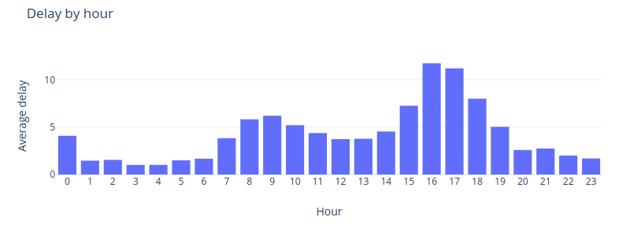

# (Never) Ride on Time

Application for scrapping and analyzing data about delays of Cracov's buses.

## Run
```dockerfile
    sudo docker-compose up
```
Runs database instance and also scraper daemon as containers. You can run app modules through:
```sbtshell
    sbt "project analyzer" run
    sbt "project scraper" run
``` 


# Data analysis
Finally after we collected the data there is a time a analyze it. 

## Tools

### Apache Spark
Big engine for not so huge data. But we it for educational purposes and to enable painless extension to analyze bigger data.

## Data

### Structure
API enabled us to download data about passages not about delays. Data from API includes time to/after passage and planned time. We have downloaded this data and saved records about passages from 5 minutes before to 5 minutes after passage. Record structure:

```scala
case class Passage(
                    actualRelativeTime: Long, // time in second to or after passage
                    actualTime: Option[String], // real time of passage - predicted in API
                    plannedTime: String, // planned time that bus should be on a stop
                    status: String, // one of: PREDICTED, STOPPING, DEPARTED
                    patternText: String, // line number
                    routeId: String, 
                    tripId: String,
                    passageid: String, // each passage of a bus from one stop has unique id - easy to group by
                    stopShortName: String, // stop id
                    scrapedTimestamp: Long 
                    )

```

### Normalization
But we want to have information about delays, not about time to passage. In the simplest version count only records with DEPARTED status, add actualRelativeTime to timestamp and compute difference between it and plannedTime.
Structure after normalization consists fields: passageid, patternText, plannedTime, stopShortName, secDelay, delay

### First stats
We have been collecting data from ... to .... We manage to create about n (7,5 mln currently) records. After normalization we have m (1 mln I think) records about buses' delays.

### Problems

#### Delay determining

#### Outliers

## Results

Graphs are generated by plot.ly

### Average delay by hour
No could predict hottest hours. No surprise here.


### Passages count by delay


### Hall of fame
And who is the winner? We couldn't skip the best latecomers.

## Data
TODO: Do we share the data to download?
