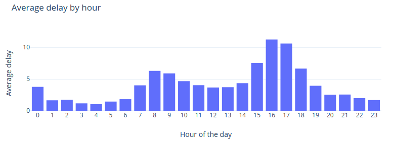
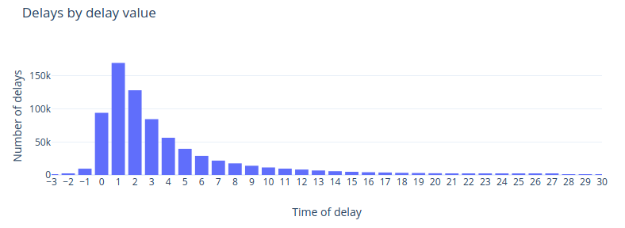
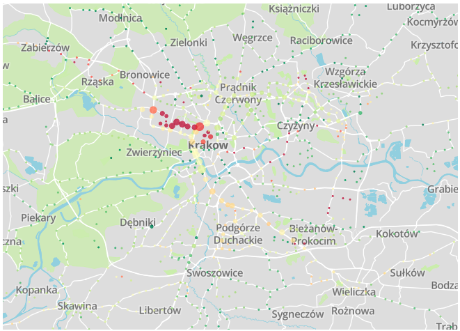

# Scraper

## Goal

We wanted to create an application that retrieves data about buses in
Cracow. There are around 1400 bus stops in Cracow and we have to query
each one separately for information about the whereabouts of nearby
buses.

## The API

### Servers

MPK has two servers, one for buses and one for trams. We decided to go only for buses.

#### Bus API

[http://91.223.13.70/internetservice](http://91.223.13.70/internetservice)

#### Tram API

[http://ttss.krakow.pl/internetservice](http://ttss.krakow.pl/internetservice)

### Endpoints - Vehicles

#### URL

[geoserviceDispatcher/services/vehicleinfo/vehicles](geoserviceDispatcher/services/vehicleinfo/vehicles)

#### Sample response

```json
{ "lastUpdate": 1560066842348,
  "vehicles": [{
    "color": "0x000000",
    "heading": 90,
    "latitude": 180069486,
    "name": "133 Bieżanów Potrzask",
    "tripId": "8095261304192117256",
    "id": "-1152921495675693247",
    "category": "bus",
    "longitude": 71798625
}] }
```

### Endpoints - Stop Info

#### URL

[geoserviceDispatcher/services/stopinfo/stops](geoserviceDispatcher/services/stopinfo/stops)

#### Sample response

```json
{ "stops": [{
    "category": "bus",
    "id": "8095258838875244269",
    "latitude": 180353736,
    "longitude": 72333180,
    "name": "Grzegorza z Sanoka (nż)",
    "shortName": "3186"
}] }
```

### Endpoints - Stops

#### URL

[services/passageInfo/stopPassages/stop?stop=ID](services/passageInfo/stopPassages/stop?stop=ID)

#### Sample response

```json
{ "actual": [{
    "actualRelativeTime": 1263,
    "direction": "Ruszcza",
    "mixedTime": "10:26",
    "passageid": "-1152921504324670730",
    "patternText": "160",
    "plannedTime": "10:26",
    "routeId": "8095257447305838788",
    "status": "PLANNED",
    "tripId": "8095261304193399306"
}] ... }
```

## Libraries

### Akka

To download data from MPK servers we use Akka and Akka-Http. We
decided to use Akka mostly because of Akka-Http and for educational
purposes.

### Mongo

We use MongoDB to persist the scraped data.

### Scala-Logging

This library works great with Akka, logs store the information
about actors that create the logs, making it easy to find problems.

## Actors

### Scheduler

Periodically schedules new requests to ApiClient.

### ApiClient

Makes requests using a shared connection pool.

### ApiResponseHandler

Parses responses and passes them to database writers.

### DatabaseWriter

Sends data to MongoDB.

### Logger

Logs stuff.

## Deployment

### Azure

We have a VM on Azure that runs the scraper and MongoDB inside a
docker container.

### Docker

Using sbt we produce a jar file containing the scraper and its
dependencies. The jar is then executed inside a docker container.

## Troubles we had

Turns out making requests to over 1400 endpoints is not that easy.

### Akka-http

Akka has a cap on how many open connections there are to a single
host, and we were breaking that quite regularly. To battle that
we used a connection pool that allows a maximum of 32 open
requests and queues the rest (overflows are dropped, they will be
scheduled again in about a minute).

### Too many stops

To reduce the number of requests we found the most useful stops
(analyzing the data we had) and reduced the number of monitored
ones to about 400.

### Not enough RAM

The VM has only 1GB of RAM and the JVM would really like to use
all of it. Adding 512MB of swap space seems to work wonders.

### Random scraper stops

After about 24 hours of working the scrapper suddenly stops
without any error messages. We suspect the lack of RAM might have
something to do with this.  To combat this problem we have a
cronjob that checks whether the scrapper is running and restarts
the container if need be.

## Result

We have created a scraper that has many failover mechanisms, can
handle VM restarts, API downtime and random crashes from unidentified
reasons. Since we added all of the above features, it has been
running flawlessly.

It scrapes data at the maximum rate possible, using as many concurrent
connections as possible.

# Data analysis
Finally after we collected the data there is a time a analyze it. 

## Tools

### Apache Spark
Big engine for not so huge data. But we it for educational purposes and to enable painless extension to analyze bigger data.

### Plot.ly
We prefer to analyze data as charts than in csv files. We used this nice tool to generate plots. 

## Data

### Structure
API enabled us to download data about passages not about delays. Data from API includes time to/after passage and planned time. We have downloaded this data and saved records about passages from 5 minutes before to 5 minutes after passage. Record structure:

```scala
case class Passage(
  actualRelativeTime: Long, // time in second to or after passage
  actualTime: Option[String], // real time of passage - predicted in API
  plannedTime: String, // planned time that bus should be on a stop
  status: String, // one of: PREDICTED, STOPPING, DEPARTED
  patternText: String, // line number
  routeId: String, 
  tripId: String,
  passageid: String, // each passage of a bus from one stop has unique id - easy to group by
  stopShortName: String, // stop id
  scrapedTimestamp: Long 
)

```

### Normalization
But we want to have information about delays, not about time to passage. In the simplest version count only records with DEPARTED status, add actualRelativeTime to timestamp and compute difference between it and plannedTime.
Structure after normalization consists fields: passageid, patternText, plannedTime, stopShortName, secDelay, delay

### First stats
We have been collecting data from 21.05 to 09.06.2019. We manage to create about 8 000 000 records (2,1 GB). After normalization we have 772057 records about buses' delays.

### Problems

#### Roadworks
During scraping data there was a lot of roadworks in Cracov. Some main roads like Królewska, Aleje and Dietla was rebuilding then.

#### Delay determining
We used simplest algorithm to determine delay. It skips situations when one bus comes about for example 20 minutes later, but previous one has come like next one should. Then maybe it is better to say that previous hasn't come and compute smaller delay for the next.

#### Outliers
There are some points that lies with very big delay or that comes very early. We could assume that bus won't come earlier than 3 minutes before schedule and won't have more than one hour delay.

## Results

### Average delay by hour
We could predict hottest hours. No surprise here.


### Passages count by delay
Looking optimistically that 1 or 2 minutes is not a delay, we can say that 



### Hall of fame - I

And who is the winner? We couldn't skip the best latecomers.  

+-----------+------------------+
|patternText|      averageDelay|  
+-----------+------------------+  
|        704|             14.25|  
|        605|             13.42|  
|        713|             10.59|  
|        910|              9.96|  
|        278|              9.43|  
|        503|              7.44|  
|        174|              6.86|  
|        111|              6.71|  
|        163|              6.61|  
|        173|              6.42|  
|        238|              6.30|  
|        161|              6.27|  
+-----------+------------------+  

### Hall of fame - II

We can see that replacement buses (704, 713) lead in ranking. They are a substitution for trams on Królewska street, departs every about 6-10 minutes and ride through the most crowded roads. You don't have to wait for them for so long time, because previous one comes when the next should, but real results look likely.

### Delay by stops
API enables us to download also coordinates of the stops and to mark them on the map. The bigger point means more passages from stop and color indicate average delay.


## Data
TODO: Do we share the data to download?

# Run
If you want to run scaper by yourself just type:
```bash
    sudo docker-compose up
```
It runs database instance and also scraper daemon as containers. You can run app modules through:
```sbtshell
    sbt "project scraper" run
    sbt "project analyzer" run
``` 
